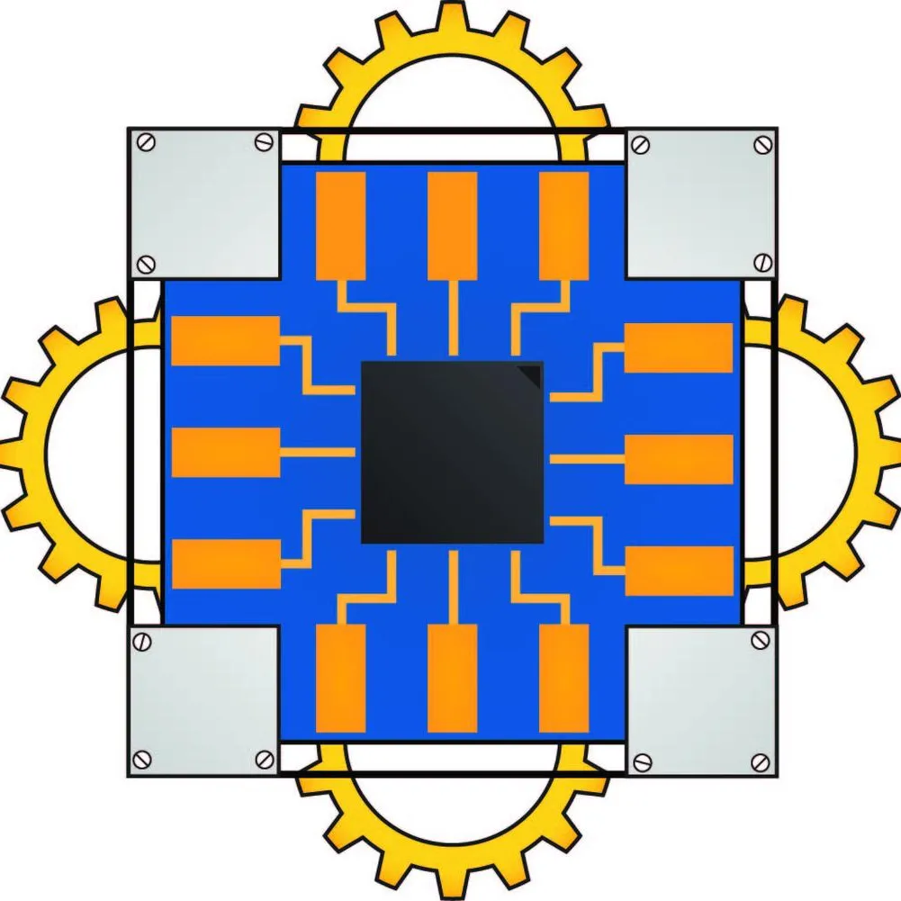
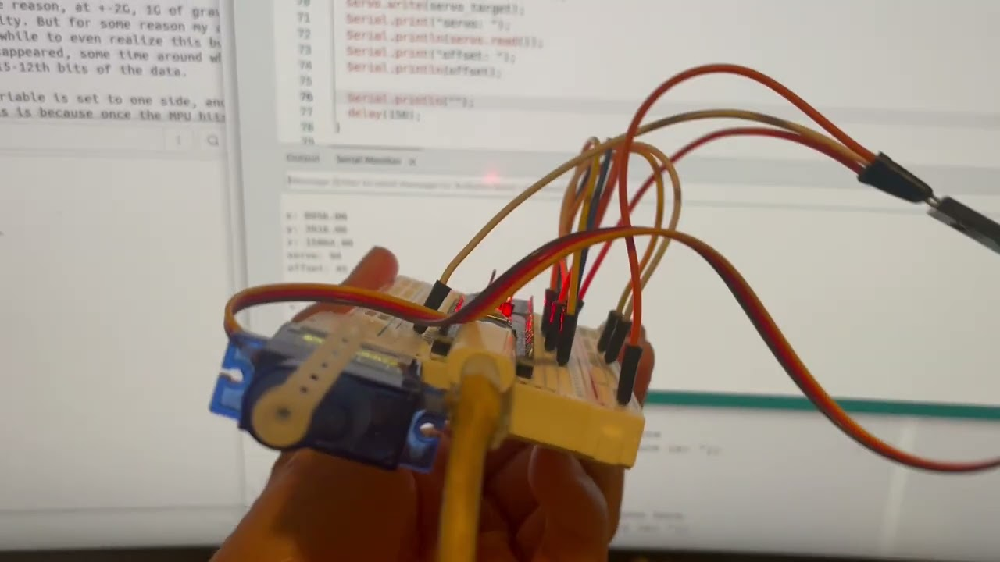
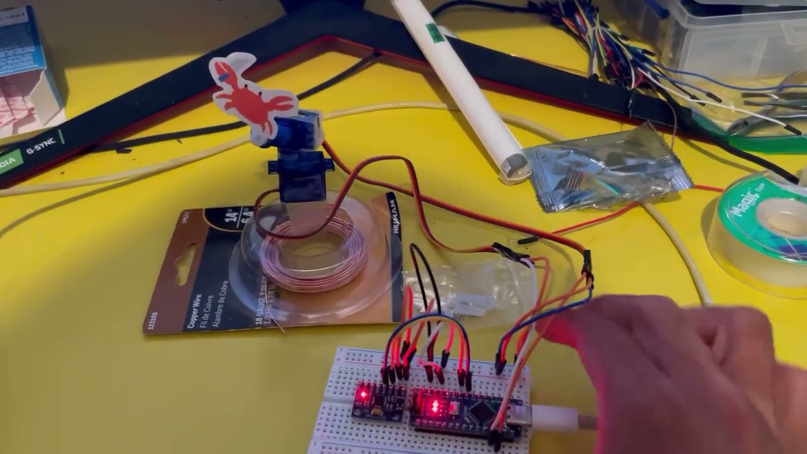

# Demos

Gimbal Project: [https://youtu.be/uEPOiu9s0O8]\

Turret Project: [https://youtu.be/SUMPuDCYfl8]\
\
This project is for the [Firmware Team Trial Project](https://docs.google.com/document/d/1K0G1oCJ2febqXuc-hIlF5nqjjRxHys7bjBQnMhwjBkk/edit?usp=sharing)
for SJSU Robotics Fall 2026.\
## Process
Most notes taken during and regarding the project are in Notes.txt. It reads more like a diary, with occasional bullet points. 
It details each step and phase of the project, what objectives and hurdles were identified and cleared next, and identifies resources
used to accomplish each step of the project.\
My experience with embedded coding is dated and minimal. At the start of the week I may as well have been considered a newbie, so my approach
was to find, study, practice, and implement various mini-projects, example codes, and tutorials for each divisible component of the project. 
This is what each of the subdirectories in this repo is for. Gimbal and Turret are the final deliverables, but there is a mini-project for:
- A fading LED
- getting readings from the MPU (two code examples)
- basic controls for the servo,
- Getting user input in the Serial Monitor
Notes.txt goes a little more in depth about what was learned and what was deemed useful for later stages of the project, as well as any links
to tutorials needed to complete each module.\
There are three branches to this project:
1. Learning modules
2. Gimbal deliverable
3. Turret deliverable
## Resources
Here is a list, for the most part in order, of resources used to learn and complete the projects:
- Linux Arduino IDE setup troubles [https://support.arduino.cc/hc/en-us/articles/29350073597468-Resolve-BRLTTY-conflict-on-Linux]
- Arduino built-in code example - LED fade [https://docs.arduino.cc/built-in-examples/basics/Fade/]
- IDE File > Examples > Examples for Arduino Nano > Wire > i2c_scanner
- MPU 6050 introduction [https://www.youtube.com/watch?v=1gNNoFwu9Nc] (Here's where I accidentally started using the MPU library)
- Another MPU 6050 introduction [https://www.youtube.com/watch?v=SVI_NldMjlE]
- Custom library Code Example: File > Examples > Adafruit MPU6050 > basic_readings, and > motion_detection
- Sparkfun Electronics, "Quick Guide to Servos" [https://www.youtube.com/watch?v=vbAZdQGTA0s]
- MY CREATIVE ENGINEERING's Servo beginner's guide [https://www.youtube.com/watch?v=niMjFyKXrCQ]
- apparently they're called servo 'horns' [https://www.youtube.com/watch?v=fbq6pyq1x4U]
- Serial Monitor input [https://www.circuitbasics.com/how-to-read-user-input-from-the-arduino-serial-monitor/]
- Didn't have time to use this but it was interesting [https://arduino.stackexchange.com/questions/22762/why-does-the-arduino-respond-so-slow-to-serial-input]
- HowToMechatronics MPU6050 tutorial. This carried my project [https://howtomechatronics.com/tutorials/arduino/arduino-and-mpu6050-accelerometer-and-gyroscope-tutorial/]
- MPU6000A/6050 Datasheet [https://cdn.sparkfun.com/datasheets/Sensors/Accelerometers/RM-MPU-6000A.pdf]
- A small free video hosting website I put my demos on [youtube.com]
- Critical hardware for the turret demo: [https://www.reddit.com/r/meme/comments/g2ozv6/i_was_bored_so_i_draw_a_crab_with_knife/]

